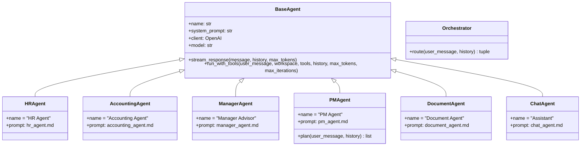

# Agents Reference — AI Assistant Internal POC

> **Version:** v0.31.0 | **Last updated:** 2026-04-02
>
> All agents output text in Thai (ภาษาไทย). All documents include a Thai Buddhist Era (พ.ศ.) date
> and an AI-draft disclaimer at the bottom.

---

## Table of Contents

1. [Agent Architecture Overview](#1-agent-architecture-overview)
2. [BaseAgent](#2-baseagent)
3. [Orchestrator](#3-orchestrator)
4. [HR Agent](#4-hr-agent)
5. [Accounting Agent](#5-accounting-agent)
6. [Manager Advisor](#6-manager-advisor)
7. [PM Agent](#7-pm-agent)
8. [Document Agent](#8-document-agent)
9. [Chat Agent](#9-chat-agent)
10. [Tool Reference](#10-tool-reference)
11. [Common Prompt Rules Shared by All Agents](#11-common-prompt-rules-shared-by-all-agents)

---

## 1. Agent Architecture Overview



Every domain agent is a thin subclass of `BaseAgent`. The only agent that adds new public methods is `PMAgent`, which adds `plan()` on top of the inherited methods. The `Orchestrator` is a standalone class (not a `BaseAgent` subclass) that performs a single non-streaming routing call.

---

## 2. BaseAgent

**File:** `agents/base_agent.py`

The foundation class shared by all domain agents.

### Constructor

```python
BaseAgent(name: str, system_prompt: str)
```

Internally calls `get_client()` and `get_model()` from `core.shared` to obtain the singleton OpenAI client and model name.

### Methods

#### `stream_response(message, history=None, max_tokens=8000)`

Simple streaming with no tool calls.

- Builds a messages array: `[system, *history, user]`
- Calls `client.chat.completions.create(stream=True)`
- Yields raw text string chunks
- Raises the underlying exception on API errors (caller must handle)

Used by: ChatAgent, and PM Agent sub-agent calls in `[PM_SUBTASK]` mode.

#### `run_with_tools(user_message, workspace, tools, history=None, max_tokens=8000, max_iterations=5)`

Agentic loop with tool execution. Yields event dicts (not SSE-formatted strings — `app.py` calls `format_sse()` on each).

**Loop behaviour (up to `max_iterations` iterations):**

1. Build messages array including any existing tool result messages from previous iterations.
2. Call `client.chat.completions.create(stream=True, tools=tools, tool_choice="auto")`.
3. Accumulate streamed delta chunks: text content yielded as `{type:"text", content:chunk}` events; tool call deltas accumulated in `tool_calls_acc` dict keyed by index.
4. On `finish_reason == "length"`: log a warning, yield a status event, abort — truncated tool args cannot be safely executed.
5. After stream ends, scan accumulated text for fake tool-call JSON patterns (regex `\{[^{}]*"(?:request|tool)"\s*:\s*"[^"]*"[^{}]*\}`) and strip them, yielding a `text_replace` event if any stripping occurred.
6. If no tool calls accumulated: yield accumulated text, return (conversation complete).
7. Validate each tool call name against `{t['function']['name'] for t in tools}`. Unknown names yield `{type:"error"}` and return.
8. Append assistant message with tool_calls to messages.
9. For each tool call: yield status event, call `execute_tool(workspace, tool_name, args)`, append tool result message, yield `tool_result` event. For `web_search` also yield `web_search_sources` event.
10. If the iteration produced only tool calls (no text), continue to next iteration for the model's final response.
11. Empty response retry: if the model returns no text and no tool calls, retry once (`MAX_EMPTY_RETRIES=1`) before yielding a user-facing error.

**Tool authorization:** step 7 above means agents can only call the tools passed in the `tools` argument. In normal mode this is `READ_ONLY_TOOLS`; in Local Agent mode it is `LOCAL_AGENT_TOOLS`. This is enforced per-call, not per-agent.

### System Prompt Injection

Every method prepends the current date in Thai Buddhist Era format to the system prompt via `inject_date()`:

```
วันที่ปัจจุบัน: 2 เมษายน พ.ศ. 2569 (ค.ศ. 2026)
Today is April 02, 2026.

<original system prompt>
```

This ensures all agents consistently use the correct Thai calendar year in generated documents without needing to be told the date.

---

## 3. Orchestrator

**File:** `core/orchestrator.py`
**Prompt file:** `prompts/orchestrator.md`

### Purpose

Routes every user message to the most appropriate agent key string. Makes a single **non-streaming** API call using `response_format={"type":"json_object"}` to guarantee parseable JSON output.

### Method

```python
Orchestrator.route(user_message: str, history: list) -> tuple[str, str]
```

Returns `(agent_key, reason_string)`. On any API error or JSON parse failure, returns `("chat", "Orchestrator unavailable")`.

### Routing Rules (from `prompts/orchestrator.md`)

| Agent key | Route when the user's request involves... |
|---|---|
| `hr` | Employment contracts, job descriptions, HR policies, leave notifications, termination letters, employee email communications |
| `accounting` | Invoices, tax documents (ใบกำกับภาษี), budgets, expense reports, financial statements, financial analysis |
| `manager` | Team management advice, performance feedback scripts, headcount requests, conflict resolution, team morale (advisory only — not generic document creation) |
| `pm` | A single request that spans multiple domains and needs documents from more than one agent simultaneously (e.g., both an employment contract and an invoice) |
| `document` | Meeting minutes, SOPs, operational procedures, marketing plans, business plans, quotations (ใบเสนอราคา), general policies, project reports, executive summaries, onboarding documents, any document request that does not clearly fit HR/Accounting/Manager |
| `chat` | Greetings, system questions ("what can you do?"), conversational turns, brainstorming without needing a file |

**Ambiguity rule:** When the Orchestrator cannot decide between `document` and `chat`, it defaults to `document` if the user appears to want a file or document as output.

**Max tokens:** `ORCHESTRATOR_MAX_TOKENS` (default 1024). Keep this low — the response is always a short JSON object.

---

## 4. HR Agent

**File:** `agents/hr_agent.py`
**Prompt file:** `prompts/hr_agent.md`
**Agent key:** `hr`
**Display name:** `HR Agent`
**Execution mode:** `run_with_tools()` with `READ_ONLY_TOOLS`

### Use Cases

| Request type | Example |
|---|---|
| Employment contract (สัญญาจ้างงาน) | "ทำสัญญาจ้างงาน นาย A ตำแหน่ง B เงินเดือน C บาท เริ่มงาน D" |
| Job Description | "เขียน JD ตำแหน่ง Senior Backend Engineer" |
| HR policy document | "ร่างนโยบายการลาพักร้อนประจำปี" |
| Leave notification | "เขียนอีเมลแจ้งพนักงานเรื่องวันหยุดพิเศษ" |
| Termination letter | "ร่างหนังสือเลิกจ้างพนักงาน" |
| Employee announcement | "เขียนประกาศรับสมัครงานตำแหน่ง UX Designer" |
| Performance review template | "สร้างแบบฟอร์มประเมินผลการทำงานรายปี" |

### Document Style Requirements (from prompt)

- Formal Thai language (ภาษาไทยที่เป็นทางการและสุภาพ)
- Dates in Buddhist Era (พ.ศ.)
- Blank placeholders for unknown information: `[วันที่]`, `[ลายมือชื่อ]`, `[ที่อยู่บริษัท]`
- Coverage of key points under Thai Labour Law (พ.รบ.คุ้มครองแรงงาน)
- Asks for missing critical information (name, salary, start date) before generating — does not invent values

### Tool Usage Policy

- `list_files` / `read_file`: only when the user explicitly names an existing file to edit
- `web_search`: only when the request mentions current-year data ("ล่าสุด", "ปัจจุบัน") or asks about the latest labour law regulations or minimum wage rates. Maximum 2 searches per response, different queries each time.
- `request_delete`: when the user asks to delete a specific HR file. Sends a browser confirmation prompt — does not delete immediately.

### Output Footer

When not in `[PM_SUBTASK]` mode:
```
💬 ต้องการแก้ไขส่วนไหนไหม? หรือพิมพ์ **บันทึก** เพื่อบันทึกไฟล์
```

When in `[PM_SUBTASK]` mode: ends at the disclaimer line only. No save prompt.

---

## 5. Accounting Agent

**File:** `agents/accounting_agent.py`
**Prompt file:** `prompts/accounting_agent.md`
**Agent key:** `accounting`
**Display name:** `Accounting Agent`
**Execution mode:** `run_with_tools()` with `READ_ONLY_TOOLS`

### Use Cases

| Request type | Example |
|---|---|
| Invoice / Tax invoice | "ออก Invoice สำหรับลูกค้า ABC มูลค่า 50,000 บาท" |
| Budget plan | "สร้างงบประมาณโครงการ Q3 2569" |
| Expense report | "จัดทำรายงานค่าใช้จ่ายของทีม Marketing เดือนมีนาคม" |
| Financial statement | "สรุปรายรับ-รายจ่ายไตรมาส 1 ปี 2569" |
| Quotation (ใบเสนอราคา) | Goes to Document Agent — not Accounting Agent |

### Document Style Requirements (from prompt)

- Number formatting: `35,000.00 บาท` (Thai convention with commas and two decimal places)
- Dates in Buddhist Era: `23 มีนาคม พ.ศ. 2569`
- Document numbers with placeholder: `[XXX-YYYY-NNNN]`
- Asks for missing critical numbers before generating — never invents financial figures
- Explicit payment terms (เงื่อนไขการชำระเงิน)

### VAT Rules (strictly enforced by prompt)

- 7% VAT applies **only** to: Invoice, ใบกำกับภาษี, ใบแจ้งหนี้
- VAT does **not** apply to: Expense Reports, internal budget documents
- Invoice calculation: `ยอดก่อน VAT + VAT 7% = ยอดรวมทั้งสิ้น`

### Tax Information Requirements (for Invoice/Tax Invoice)

The prompt requires placeholder lines for:
- เลขประจำตัวผู้เสียภาษี 13 หลัก: `[X-XXXX-XXXXX-XX-X]` (both issuer and recipient)
- สาขา: `[สำนักงานใหญ่]` or `[สาขาที่ XXXXX]`
- Full address for both parties

### Tool Usage Policy

Same as HR Agent. `web_search` triggers on requests about current VAT rates, latest accounting regulations, or tax law updates.

---

## 6. Manager Advisor

**File:** `agents/manager_agent.py`
**Prompt file:** `prompts/manager_agent.md`
**Agent key:** `manager`
**Display name:** `Manager Advisor`
**Execution mode:** `run_with_tools()` with `READ_ONLY_TOOLS`

### Purpose and Scope

Manager Advisor is an **advisory-only** agent. Its role is to help Team Leads and managers handle team situations — not to create general documents. It produces actionable scripts, frameworks, and step-by-step guidance rather than formal structured documents.

### Use Cases

| Request type | Example |
|---|---|
| Performance feedback script | "เขียนสคริปต์คุยกับพนักงานที่ส่งงานช้าบ่อยครั้ง" |
| Headcount justification | "ช่วยเขียน case ขอเพิ่มทีม 2 คน" |
| Conflict resolution | "มีปัญหาระหว่าง 2 คนในทีม ควรจัดการอย่างไร" |
| Priority decision | "งาน A กับ B สำคัญเท่ากัน จะ prioritize อย่างไร" |
| Team morale | "ทีมดูหมดไฟ ควรทำอะไรใน 48 ชั่วโมงแรก" |
| 1:1 meeting structure | "ออกแบบ agenda การ 1:1 กับทีม" |

### Response Style (from prompt)

- Acknowledges the situation before giving advice: "เข้าใจสถานการณ์แล้วครับ..."
- Focuses on actions achievable within 48 hours
- Provides actual script text the manager can say verbatim
- Accounts for Thai workplace culture (ลำดับชั้น, face-saving, indirect communication norms)
- Concise and direct — no padding

### What Manager Advisor Does NOT Do

- Does not generate generic documents (use Document Agent for SOPs, meeting minutes, etc.)
- Does not create HR policies (use HR Agent)
- Does not create financial documents of any kind

### Tool Usage Policy

`web_search` triggers when the request involves current industry benchmarks, latest management trends, or explicitly requests "ล่าสุด" / "ปัจจุบัน" information.

---

## 7. PM Agent

**File:** `agents/pm_agent.py`
**Prompt file:** `prompts/pm_agent.md`
**Agent key:** `pm`
**Display name:** `PM Agent`
**Execution mode:** `plan()` (custom) + delegates to sub-agents via `stream_response()`

### Purpose

Handles requests that span multiple agent domains simultaneously. Instead of routing to a single agent, it decomposes the request into a list of per-domain subtasks and executes each one sequentially.

### Additional Method: `plan()`

```python
PMAgent.plan(user_message: str, history: list) -> list[dict]
```

- Makes a **non-streaming** API call with `response_format={"type":"json_object"}`
- Max tokens: `2048`
- Returns a filtered list of `{agent: str, task: str}` dicts where `agent` is one of `{"hr", "accounting", "manager"}`
- Returns `[]` on any API error or JSON parse failure
- The `pm` key itself is never a valid subtask agent — a PM Agent cannot delegate to another PM Agent

### Subtask JSON Schema (from `prompts/pm_agent.md`)

```json
{
  "subtasks": [
    {"agent": "hr",          "task": "Self-contained task description with all details copied from the original request"},
    {"agent": "accounting",  "task": "Self-contained task description with all details copied from the original request"}
  ]
}
```

### PM Prompt Rules (from `prompts/pm_agent.md`)

1. Every subtask must be **self-contained** — it must include all names, numbers, dates, and conditions from the original request. No "see above" references.
2. Valid sub-agents: `hr`, `accounting`, `manager` only.
3. Do not instruct sub-agents to save files — the system handles saving automatically.
4. Use a single agent when the request clearly belongs to one domain.
5. Output must be pure JSON — no markdown fences, no preamble, no explanation text.

### Execution Flow in `app.py`

1. PM Agent calls `plan()` to get the subtask list.
2. For each subtask in order: `AgentFactory.get_agent(subtask['agent']).stream_response("[PM_SUBTASK]\n" + subtask['task'], max_tokens=AGENT_MAX_TOKENS)`
3. The `[PM_SUBTASK]` prefix suppresses the save-prompt footer in sub-agent responses.
4. Content is stripped of the `[PM_SUBTASK]` echo and any leaked save footers.
5. Content written to `temp/<agent>_<slug>_<timestamp>.md`.
6. Browser receives `pending_file` events and displays a save confirmation prompt.
7. On user confirmation ("บันทึก"), `handle_pm_save()` moves files from `temp/` to `workspace/` with optional format conversion.

### Workspace Safety

Subtasks run sequentially, not concurrently, to prevent two sub-agents writing to the same workspace path at the same time.

---

## 8. Document Agent

**File:** `agents/document_agent.py`
**Prompt file:** `prompts/document_agent.md`
**Agent key:** `document`
**Display name:** `Document Agent`
**Execution mode:** `run_with_tools()` with `READ_ONLY_TOOLS`

### Purpose

The Document Agent is the catch-all for business document requests that do not belong to HR, Accounting, or Manager domains. It is the most frequently routed agent in practice.

### Document Types Supported

| Type | Thai term |
|---|---|
| Meeting minutes | รายงานการประชุม |
| Standard Operating Procedure | คู่มือการใช้งาน / SOP |
| Marketing plan | แผนการตลาด |
| Business plan | แผนธุรกิจ |
| Strategic plan | แผนกลยุทธ์ |
| Quotation | ใบเสนอราคา (not an Invoice — that goes to Accounting) |
| General policy | นโยบายทั่วไป (not an HR policy) |
| Project report | รายงานโครงการ |
| Performance report | รายงานผลการดำเนินงาน |
| Onboarding documents | เอกสาร Onboarding / Welcome Pack |
| Executive summary | บทสรุปผู้บริหาร |
| Any unlabelled document request | "ทำเป็นเอกสาร", "สร้างเป็นไฟล์", "ใช้เอเจนสร้างไฟล์" |
| Converting conversation to document | "สรุปสิ่งที่คุยไปเป็นรายงาน" |

### Document Style Requirements (from prompt)

- Formal Thai, concise and readable
- Clear heading structure with `##` and `###`
- Tables for comparing multiple items
- Bullet points for unordered lists; numbered lists for sequential steps
- Does not invent missing data — uses `[กรอกข้อมูล]` placeholders
- Asks no more than 3 clarifying questions before starting, and only when critical fields are missing

### Tool Usage Policy

Same as HR Agent. `web_search` triggers for documents that require real-time data (current market prices, latest statistics, new regulations).

---

## 9. Chat Agent

**File:** `agents/chat_agent.py`
**Prompt file:** `prompts/chat_agent.md`
**Agent key:** `chat`
**Display name:** `Assistant`
**Execution mode:** `run_with_tools()` with `READ_ONLY_TOOLS`

### Purpose

Handles all non-document interactions: greetings, system questions, conversational follow-ups, brainstorming, and any request where the user clearly does not need a structured output file.

### Capabilities (from prompt)

- Answers general questions and explains concepts
- Describes what the AI Assistant system can do and guides users to the right agent
- Continues the conversation using context from previous turns
- Helps brainstorm before the user places a real document request
- Uses `web_search` for queries about current events, stock news, or time-sensitive information the user asks about in conversational mode

### Tone and Style

- Friendly and informal Thai (`เป็นกันเอง`)
- Concise — does not over-explain
- When a user appears to want a document, suggests they rephrase as a direct request: "ถ้าต้องการสัญญาจ้าง ลองพิมพ์รายละเอียดได้เลยครับ"

### Context Awareness

The Chat Agent prompt explicitly instructs it to use conversation history for pronoun resolution. If the user says "ข้อมูลนี้" (this information) or "ข่าวนี้" (this news), the agent looks at recent messages to resolve what is being referenced before responding or searching.

### Token Budget

Uses `CHAT_MAX_TOKENS` (default 8,000) rather than `AGENT_MAX_TOKENS` (default 32,000) to keep conversational turns fast.

---

## 10. Tool Reference

All agents in normal mode receive `READ_ONLY_TOOLS`. In Local Agent Mode they receive `LOCAL_AGENT_TOOLS`.

### Tools in `READ_ONLY_TOOLS`

These tools are available to all agents in normal mode via the `run_with_tools()` agentic loop.

#### `list_files`

Lists all files in the current workspace.

- **Input:** none
- **Output:** Formatted string listing each file with name, size in bytes, and last-modified timestamp
- **When to use:** When the user asks about existing files or requests editing a file without naming it specifically

#### `read_file`

Reads the content of a named file from the workspace.

- **Input:** `filename` (string)
- **Output:** File content as plain text. Binary formats (`.docx`, `.xlsx`, `.pdf`) are automatically extracted to text. Capped at 80,000 characters.
- **When to use:** Only when the user explicitly names an existing file and asks to edit or reference it

#### `web_search`

Searches the internet using DuckDuckGo.

- **Input:** `query` (string), `max_results` (integer, 3–5)
- **Output:** Formatted search results with title, body, and source URL for each result. Returns "ไม่พบผลลัพธ์การค้นหา" if no results found.
- **Timeout:** `WEB_SEARCH_TIMEOUT` seconds (default 15)
- **Limit:** Maximum 3 web search calls per agent turn (enforced by `BaseAgent`)
- **When to use:** For time-sensitive information: current tax rates, latest labour law, current market prices, recent news

#### `request_delete`

Requests deletion of a workspace file with user confirmation.

- **Input:** `filename` (string)
- **Output:** Marker string `__DELETE_REQUEST__:<filename>` which `app.py` intercepts and converts to a `delete_request` SSE event. The browser shows a confirmation dialog. The agent does not delete the file itself.
- **When to use:** When the user asks to delete a file from the workspace

### Tools in `LOCAL_AGENT_TOOLS`

Used only when `local_agent_mode: true` is passed from the browser. Disables workspace writes — the agent cannot create or modify server-side files.

#### `web_search`

Same as above.

#### `local_delete`

Sends a `local_delete` SSE event instructing the browser to delete a file from the user's local machine.

- **Input:** `filename` (string)
- **Output:** Marker string `__LOCAL_DELETE__:<filename>`

### Tools NOT offered to agents (write operations)

`create_file`, `update_file`, and `delete_file` are defined in `MCP_TOOLS` but are not passed to agents in either tool set. All workspace writes go through explicit user confirmation handlers (`handle_save`, `handle_pm_save`) in `app.py`, ensuring no file is written without explicit user approval.

---

## 11. Common Prompt Rules Shared by All Agents

The following rules appear in every agent's system prompt (`hr_agent.md`, `accounting_agent.md`, `manager_agent.md`, `document_agent.md`, and `chat_agent.md`):

### 1. Acknowledgement opener

Start with a single sentence acknowledging the task before producing the document body.
Example: "รับทราบครับ จะจัดทำสัญญาจ้างให้เลยนะครับ"

### 2. Tool call format enforcement

Never write tool call JSON as plain text in the response body. Example of what is forbidden:
```
{"request": "web_search", "query": "อัตราภาษี 2569"}
```
Tool calls must go through the structured tool_calls channel only. This is enforced by `BaseAgent`'s fake-tool-call stripper as a technical backstop.

### 3. `list_files` / `read_file` usage restriction

Use these tools **only** when:
- The user explicitly names an existing file in their request
- The request is clearly an edit or extension of that specific file

Do not call these tools speculatively to "see what might be relevant." This avoids slow unnecessary reads and context pollution.

### 4. `web_search` usage limit

Maximum 2 searches per response (the technical limit in `BaseAgent` is 3 — the prompt is more conservative). Each search must use a different query. Do not search for general knowledge that does not require real-time data.

### 5. AI draft disclaimer

Every document must include this line at the end:

```
⚠️ เอกสารฉบับร่างนี้จัดทำโดย AI — กรุณาตรวจสอบความถูกต้องก่อนนำไปใช้งานจริง
```

### 6. `[PM_SUBTASK]` mode

When the message begins with `[PM_SUBTASK]`:
- End the response immediately after the disclaimer line
- Do not append the save-prompt footer
- Do not output any JSON or tool call syntax in the response body
- The system (app.py) handles all file saving automatically

### 7. Normal mode footer

When not in `[PM_SUBTASK]` mode, end every document response with:

```
💬 ต้องการแก้ไขส่วนไหนไหม? หรือพิมพ์ **บันทึก** เพื่อบันทึกไฟล์
```
