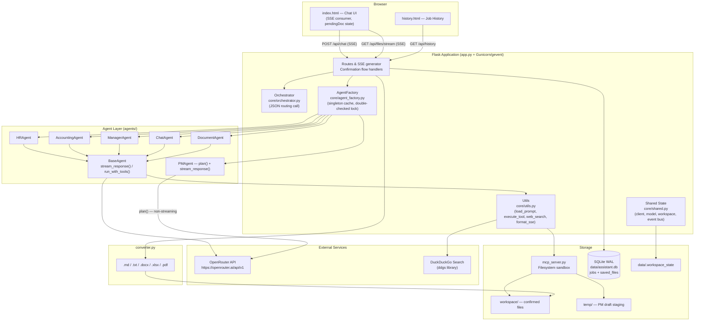
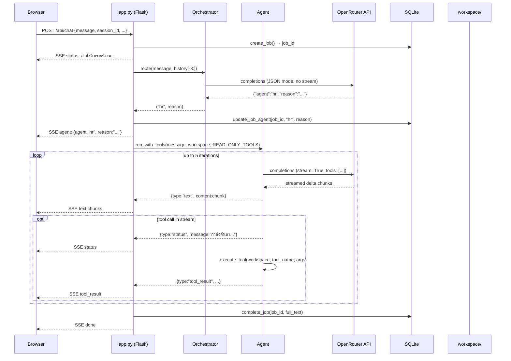
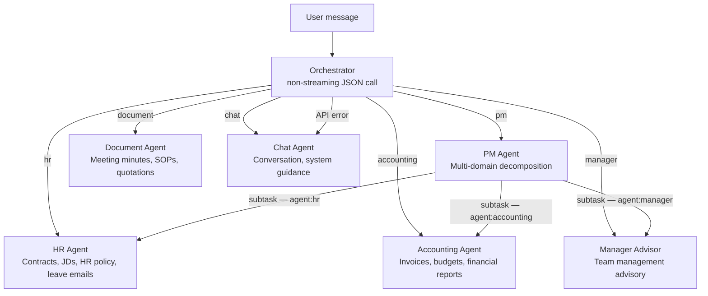
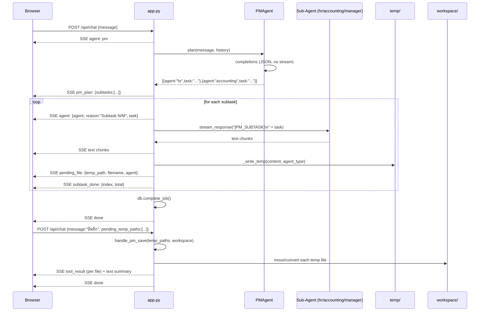
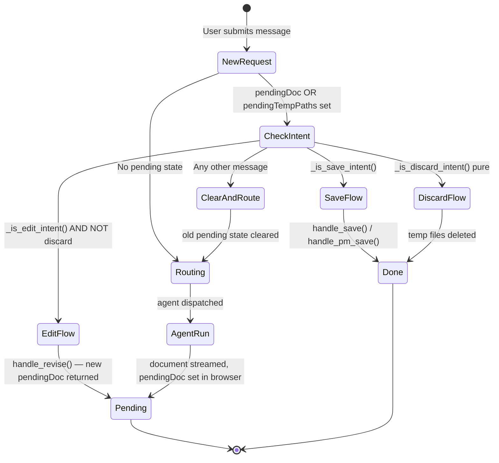
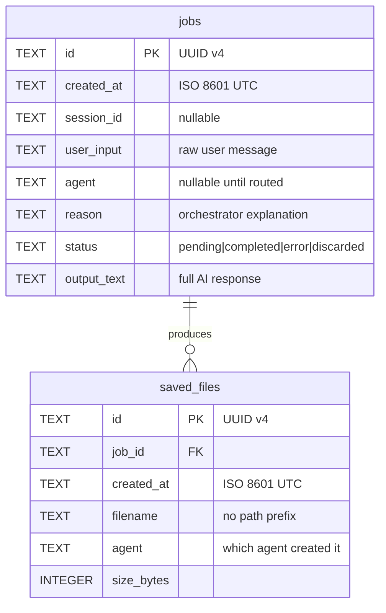

# Architecture — AI Assistant Internal POC

> **Version:** v0.31.0 | **Last updated:** 2026-04-02

---

## Table of Contents

1. [System Overview](#1-system-overview)
2. [High-Level Component Diagram](#2-high-level-component-diagram)
3. [Layer Explanations](#3-layer-explanations)
4. [Request Lifecycle](#4-request-lifecycle)
5. [Agent Routing Flow](#5-agent-routing-flow)
6. [SSE Streaming Architecture](#6-sse-streaming-architecture)
7. [PM Agent Subtask Decomposition](#7-pm-agent-subtask-decomposition)
8. [Confirmation Flow (Save / Edit / Discard)](#8-confirmation-flow-save--edit--discard)
9. [Workspace and File Storage Strategy](#9-workspace-and-file-storage-strategy)
10. [Database Design](#10-database-design)
11. [Auth and Security Model](#11-auth-and-security-model)
12. [Background Jobs and Cleanup](#12-background-jobs-and-cleanup)
13. [Key Design Decisions](#13-key-design-decisions)

---

## 1. System Overview

The AI Assistant Internal POC is a Thai-language internal business document assistant. Users send natural-language requests through a browser chat UI. A central Orchestrator calls the LLM (via OpenRouter) to classify each request and dispatch it to the correct specialized AI agent — HR, Accounting, Manager, PM, Document, or Chat. The selected agent runs an agentic loop that may call filesystem tools and web search, then streams the response back to the browser in real time via Server-Sent Events (SSE).

Generated documents do not save automatically. The system presents them for user review in a confirmation flow (save / edit / discard) before writing any file to the sandboxed workspace directory. The PM Agent extends this by decomposing a single complex request into per-domain subtasks, each handled by the appropriate specialist agent, with all resulting drafts staged in `temp/` until the user approves saving.

When a user sends a message through the browser, the request flows through a confirmation-flow interceptor (which handles pending document save/discard/edit states), then to the Orchestrator which calls the LLM to determine which agent should handle the request. The selected agent — HR, Accounting, Manager, PM, Chat, or Document — processes the request using a tool-calling agentic loop that can read files, search the web, and generate content. All responses stream back to the browser as SSE events. Generated documents enter a confirmation workflow where the user must explicitly approve saving, discarding, or revising before any file is written to the workspace.

Recent backend hardening tightened three weak points in that flow: PM planning now degrades safely when its upstream API call fails, PM "no plan" errors now still terminate the SSE stream with a `done` event, and truncated tool-call payloads in `BaseAgent.run_with_tools()` are rejected before incomplete JSON arguments can be parsed.

---

## 2. High-Level Component Diagram



---

## 3. Layer Explanations

### 3.1 Presentation Layer — `index.html`, `history.html`

Single-file vanilla HTML/CSS/JavaScript SPA; no build step or framework required.

Key client-side state variables (module-scoped JS):

| Variable | Purpose |
|---|---|
| `pendingDoc` | Full Markdown text of the last AI-generated document, held until user saves/edits/discards |
| `pendingAgent` | Agent key string (`hr`, `accounting`, etc.) for the pending document |
| `pendingTempPaths` | Array of `temp/` file paths from a PM subtask run |
| `conversationHistory` | Array of `{role, content}` objects sent to `/api/chat` on every turn |
| `sessionId` | UUID assigned at page load; scopes the workspace for this tab |
| `outputFormat` | Selected export format (`md`, `txt`, `docx`, `xlsx`, `pdf`) |
| `localAgentMode` | Boolean flag enabling the local-filesystem tool set |

The browser subscribes to `/api/files/stream` via `EventSource` to receive `files_changed` events and refresh the file sidebar without polling.

All AI-generated HTML is passed through a client-side `_sanitizeHtml()` function before DOM insertion to prevent XSS from reflected content.

### 3.2 Application Layer — `app.py`

Contains all route handlers and the core SSE generator function `generate()`. Responsibilities:

- Validates every incoming parameter (session IDs via `^[\w\-]{8,64}$`, filenames via `^[\w.\-]{1,120}$`)
- Implements the confirmation state machine by detecting intent keywords in user messages before dispatching to agents
- Wraps all agent output in SSE format and streams it using `stream_with_context`
- Enforces per-IP rate limiting (10/min on `/api/chat`, 20/min on `/api/delete`)
- Captures workspace path **once** at the start of `generate()` and passes it as a parameter — never re-reads the global inside the loop
- Records all jobs to the database; uses a `finally` block to ensure no job is left permanently `pending`

The `generate()` function for `/api/chat` handles three execution paths, tried in order:
1. **PM save/discard** — if `pending_temp_paths` is non-empty
2. **Single-agent confirm/edit/discard** — if `pending_doc` + `pending_agent` are non-empty
3. **New request** — orchestrate, route, and run agent

### 3.3 Core Layer — `core/`

| Module | Key exports | Purpose |
|---|---|---|
| `shared.py` | `get_client()`, `get_model()`, `get_workspace()`, `set_workspace()`, `get_session_workspace()`, `set_session_workspace()`, `_notify_workspace_changed()`, `AGENT_MAX_TOKENS`, `CHAT_MAX_TOKENS`, `TEMP_DIR` | Global singletons and shared mutable state. The OpenAI client is lazy-initialized with a double-checked lock. Workspace state is persisted to `data/.workspace_state` across restarts. |
| `orchestrator.py` | `Orchestrator.route(user_message, history)` | Single non-streaming API call using `response_format={"type":"json_object"}`. Returns `(agent_key, reason_string)`. Falls back to `("chat", "Orchestrator unavailable")` on any exception. |
| `agent_factory.py` | `AgentFactory.get_agent(agent_type)` | Thread-safe singleton cache using double-checked locking. Unknown agent types fall back to `ChatAgent`. |
| `utils.py` | `load_prompt()`, `inject_date()`, `execute_tool()`, `format_sse()`, `_web_search()`, `extract_web_sources()` | Shared helper functions. `inject_date()` prepends the current Thai Buddhist calendar date to every system prompt. |

### 3.4 Agent Layer — `agents/`

`BaseAgent` provides two execution modes used by all agents:

**`stream_response(message, history, max_tokens)`** — Simple streaming, no tool calls. Used when a PM subtask calls sub-agents, or when the Chat Agent handles conversational turns. The history list is injected directly into the messages array.

**`run_with_tools(user_message, workspace, tools, history, max_tokens, max_iterations=5)`** — Agentic loop. Each iteration:
1. Calls the LLM with `stream=True` and the tools list.
2. Accumulates streamed text chunks and tool call deltas simultaneously.
3. On `finish_reason == "length"`, warns and returns (truncated tool args are rejected).
4. After the stream ends: if no tool calls, yields accumulated text and returns.
5. Checks all tool call names against the `allowed_names` set — rejects unknown tools with an `error` event.
6. Executes each tool call via `execute_tool()`, appends `tool` role messages, and continues the loop.
7. Handles empty responses with one retry before yielding a user-facing error message.

Fake tool-call JSON (some models emit `{"request":"web_search",...}` as plain text instead of using the structured tool call channel) is detected by regex and stripped before yielding to the browser.

Each domain agent is a thin subclass:

```python
class HRAgent(BaseAgent):
    def __init__(self):
        super().__init__(name="HR Agent", system_prompt=load_prompt("hr_agent"))
```

`PMAgent` extends this with an additional `plan()` method that makes a non-streaming JSON-mode call and returns a list of `{agent, task}` subtask dicts.

### 3.5 Storage Layer

| Component | File | Purpose |
|---|---|---|
| SQLite database | `data/assistant.db` | Job tracking, session history, file audit records. WAL mode for concurrent reads. Graceful degradation — all public functions return safe defaults on failure. |
| MCP filesystem | `mcp_server.py` | Sandboxed file operations. `_validate_path()` uses `commonpath()` to block path traversal. Layer A = direct Python functions. Layer B = FastMCP standalone server (optional). |
| Document export | `converter.py` | Converts Markdown to `.txt`, `.docx`, `.xlsx`, `.pdf`. Returns bytes. PDF uses WeasyPrint + Thai system fonts. |

---

## 4. Request Lifecycle



---

## 5. Agent Routing Flow



The Orchestrator prompt (`prompts/orchestrator.md`) lists explicit heuristics for each agent key. When ambiguous between `document` and `chat`, the prompt instructs defaulting to `document` if the user appears to want a file.

The valid agent keys are: `hr`, `accounting`, `manager`, `pm`, `document`, `chat`. Any other key returned by the LLM causes `AgentFactory` to fall back to `ChatAgent` and log a warning.

---

## 6. SSE Streaming Architecture

`/api/chat` returns `Content-Type: text/event-stream; charset=utf-8` with these response headers:

```
Cache-Control: no-cache
X-Accel-Buffering: no
Connection: keep-alive
```

`X-Accel-Buffering: no` is required when Nginx is used as a reverse proxy — it disables Nginx's default response buffering so SSE events reach the browser immediately.

Each event frame:

```
data: {"type": "text", "content": "สวัสดีครับ"}\n\n
```

### Complete Event Reference

| type | Additional fields | Emitted by | Meaning |
|---|---|---|---|
| `status` | `message: str` | `app.py`, `BaseAgent` | Progress notification |
| `agent` | `agent: str`, `reason: str`, `task?: str` | `app.py` | Agent selected (or PM subtask started) |
| `text` | `content: str` | `BaseAgent` | Streamed text chunk |
| `text_replace` | `content: str` | `BaseAgent` | Replaces all accumulated text (after fake-tool-call strip) |
| `tool_result` | `tool: str`, `result: str`, `filename?: str` | `BaseAgent`, `app.py` | Tool execution result; browser shows inline |
| `web_search_sources` | `query: str`, `sources: [{url, domain}]` | `BaseAgent` | Source citations from web search |
| `pm_plan` | `subtasks: [{agent, task}]` | `app.py` | PM subtask plan |
| `pending_file` | `temp_path: str`, `filename: str`, `agent: str` | `app.py` | A PM draft file staged in `temp/` |
| `subtask_done` | `agent: str`, `index: int`, `total: int` | `app.py` | One PM subtask finished |
| `delete_request` | `filename: str` | `app.py` | Agent wants to delete a file; browser shows confirm dialog |
| `local_delete` | `filename: str` | `app.py` | Local Agent mode: browser deletes file on local machine |
| `save_failed` | `message: str` | `handle_save()` | File write error |
| `error` | `message: str` | `app.py`, `BaseAgent` | Unrecoverable error; stream may still continue |
| `done` | _(none)_ | `app.py` | Stream complete; browser finalises UI state |
| `files_changed` | _(none)_ | `api_stream_files()` | Workspace changed; browser re-fetches file list |
| `heartbeat` | _(none)_ | `api_stream_files()` | Keepalive on `/api/files/stream` every 30 s |

### Workspace Change Notification Bus

`/api/files/stream` creates a `queue.Queue` per connection and registers it in `_ws_change_queues[workspace_path]`. After any file write/delete, `_notify_workspace_changed(workspace)` iterates all registered queues for that workspace and puts a message in each (`put_nowait` — drops silently if full). Each SSE connection's `generate()` loop dequeues with a 30-second timeout; on timeout it emits a `heartbeat` instead.

---

## 7. PM Agent Subtask Decomposition



Key constraints:
- Subtasks run **sequentially**, not in parallel, to avoid concurrent writes to the same workspace path.
- Each sub-agent is invoked with `stream_response()` (no tool calls). The `[PM_SUBTASK]` prefix in the message suppresses the save-prompt footer in agent responses.
- Any empty-content subtask is silently skipped (no temp file created).
- On any subtask exception, all accumulated temp files are deleted and a `done` event terminates the stream.
- The browser sends `pending_temp_paths` back in the follow-up message. `app.py` validates each path with `_is_safe_temp_path()` (must be under `TEMP_DIR`) before processing.

---

## 8. Confirmation Flow (Save / Edit / Discard)

The browser accumulates the full streamed text as `pendingDoc`. On the next user message, `app.py` inspects the text before routing to any agent.



Intent keyword sets (from `app.py`):

| Intent | Keywords |
|---|---|
| Save | `บันทึก`, `เซฟ`, `ยืนยัน`, `ตกลง`, `ได้เลย`, `โอเค`, `ใช้ได้`; word-boundary `ok`, `save` |
| Discard | `ยกเลิก`, `cancel`, `ไม่เอา`, `ไม่บันทึก`, `ไม่ต้องการ`, `discard` |
| Edit | `แก้ไข`, `แก้`, `ปรับ`, `เพิ่ม`, `ลบ`, `เปลี่ยน`, `edit`, `modify`, `update`, `fix`, `add`, `remove` |

Negative-prefix guard: messages starting with `ไม่ใช่` or `ไม่ใช้` do not trigger save intent even if they contain a save keyword.

---

## 9. Workspace and File Storage Strategy

### Directory Layout

```
project_root/
├── workspace/          <- default workspace (confirmed, user-visible files)
│   └── *.md / *.txt / *.docx / *.xlsx / *.pdf
├── temp/               <- PM Agent staging area (auto-purged after 60 min)
│   └── *.md
└── data/
    ├── assistant.db    <- SQLite database
    └── .workspace_state <- persisted last-active workspace path
```

### Path Security

All file operations route through `mcp_server._validate_path(workspace, filename)`:

```python
workspace_abs = str(Path(workspace).resolve())   # resolves symlinks
target        = str(Path(workspace_abs, filename).resolve())
if os.path.commonpath([workspace_abs, target]) != workspace_abs:
    raise ValueError(...)
```

This rejects any `filename` containing `../`, absolute paths (`/etc/passwd`), and symlink escapes.

At the app layer, workspace changes are additionally gated by `_is_allowed_workspace_path()` which checks the resolved path against `ALLOWED_WORKSPACE_ROOTS`.

### Session-Scoped Workspaces

Every browser tab generates a UUID `sessionId`. `GET /api/workspace?session_id=<id>` and `POST /api/workspace {session_id, path}` read/write per-session workspace mappings stored in `_session_workspaces: dict` in `shared.py`. All workspace-sensitive routes accept `session_id` and resolve through `get_session_workspace(session_id)`.

If a request supplies a syntactically invalid `session_id` (fails the `^[\w\-]{8,64}$` regex), the server returns HTTP 400 instead of silently falling back to the global workspace. This prevents cross-session data leakage from malformed client state.

### Supported File Formats

| Extension | Read | Write | Notes |
|---|---|---|---|
| `.md` | plain text | plain text | default output format |
| `.txt` | plain text | plain text | |
| `.docx` | paragraph text extraction | python-docx | Thai font TH Sarabun New |
| `.xlsx` | tab-delimited sheet extraction | openpyxl | header row highlighted |
| `.pdf` | pdfplumber text extraction | WeasyPrint | Thai font Norasi/Garuda; 100 KB char limit |

Text reads cap at 80,000 characters to stay within most LLM context windows.

---

## 10. Database Design

File: `data/assistant.db` — SQLite 3 with WAL journal mode and `PRAGMA foreign_keys=ON`.



**Indexes:** `idx_jobs_created ON jobs(created_at DESC)` and `idx_files_job_id ON saved_files(job_id)`.

**Thread safety:** all writes go through a module-level `_db_write_lock = threading.Lock()`.

**Graceful degradation:** `DB_AVAILABLE` flag is set to `False` on any `init_db()` failure. Every public function checks this flag first and returns a safe default (`None` / `[]` / `False`) without raising. DB failures are logged but never propagate to the SSE flow.

**Zombie cleanup:** on startup, any `pending` job older than 1 hour is set to `error`. This cleans up jobs that were created during a server crash mid-stream.

---

## 11. Auth and Security Model

This is an internal POC. There is no authentication or authorization beyond the controls listed below.

| Control | Mechanism |
|---|---|
| Rate limiting | flask-limiter: 10 req/min per IP on `/api/chat`; 20/min on `/api/delete` |
| Path traversal | `_validate_path()` using `Path.resolve()` + `commonpath()` |
| Workspace root restriction | `ALLOWED_WORKSPACE_ROOTS` checked via `_is_allowed_workspace_path()` |
| Filename validation | Regex `^[\w.\-]{1,120}$` on all file-related API inputs |
| Session ID validation | Regex `^[\w\-]{8,64}$`; invalid ID returns HTTP 400, not a silent fallback |
| Tool authorization | `run_with_tools()` compares each tool call name against `allowed_names` before execution |
| Pending doc cap | `MAX_PENDING_DOC_BYTES` (default 200 KB) limits POST body for document content |
| CORS | Origin whitelist via `CORS_ORIGINS` env var; defaults to `localhost:5000` only |
| XSS | Client-side `_sanitizeHtml()` applied to all AI-generated content before DOM insertion |

---

## 12. Background Jobs and Cleanup

### Zombie Job Cleanup (startup)

`db.init_db()` — called once at Flask startup — runs:
```sql
UPDATE jobs SET status = 'error'
WHERE status = 'pending'
AND created_at < datetime('now', '-1 hour')
```

### Temp File Cleanup (per-request)

`_cleanup_old_temp()` is called at the top of every `/api/chat` `generate()` invocation. It iterates `temp/` and removes files older than 3600 seconds (excluding `.gitkeep`).

### Cron Job (registered by `setup.sh`)

```cron
*/30 * * * * find /path/to/project/temp -type f -mmin +60 ! -name '.gitkeep' -delete
```

Runs every 30 minutes as a safety net independent of the Flask process.

---

## 13. Key Design Decisions

### OpenRouter over direct model APIs

OpenRouter is a single endpoint that proxies Claude, Gemini, Qwen, Llama, and others. Switching models requires only changing `OPENROUTER_MODEL` in `.env`. This was critical for the POC phase where the team wanted to compare models without code changes.

### Gunicorn + gevent over async frameworks

The codebase uses the synchronous OpenAI Python client with streaming. gevent monkey-patches I/O primitives to be cooperative, allowing hundreds of concurrent SSE connections (each a greenlet) without the complexity of `asyncio`. The trade-off is that CPU-intensive operations (WeasyPrint PDF rendering) block the worker process for their duration.

### Workspace captured once per SSE request

`get_workspace()` is called exactly once at the top of `generate()` and passed as a parameter to `handle_save`, `handle_pm_save`, and every `run_with_tools` call. Never re-read inside a loop. This avoids a race condition where a concurrent `POST /api/workspace` could redirect an in-flight document save to the wrong directory.

### Read-only tools for agents in normal mode

Agents in normal mode receive `READ_ONLY_TOOLS` = `[list_files, read_file, web_search, request_delete]`. Write operations (`create_file`, `update_file`, `delete_file`) are not offered to the agent. All writes go through explicit user-facing confirmation handlers (`handle_save`, `handle_pm_save`) in `app.py`. This is a deliberate guardrail ensuring no file is written without user review.

### SQLite graceful degradation

Every `db.*` function catches its own exceptions and returns safe defaults. If the database becomes unavailable mid-run (disk full, permissions error), the chat continues working and job history is simply not recorded. This was a deliberate choice for a POC where reliability of the AI conversation was more important than audit logging.

### Double-checked locking in AgentFactory

Agent instances load their system prompts from disk on construction. The `AgentFactory` caches them after first use. The double-checked lock pattern ensures the fast path (already cached) runs without acquiring a lock on every request, while the slow path (first instantiation) is still thread-safe.
│  ┌────────────┐  ┌──────────────┐  ┌──────────────┐  ┌───────────┐ │
│  │ Chat UI    │  │ File Sidebar │  │ Format Modal │  │ Workspace │ │
│  │ SSE recv   │  │ SSE/poll     │  │ (save)       │  │ Picker    │ │
│  └─────┬──────┘  └──────┬───────┘  └──────┬───────┘  └─────┬─────┘ │
└────────┼────────────────┼─────────────────┼────────────────┼───────┘
         │ POST /api/chat │ GET /api/files  │ POST /api/     │ GET /api/
         │ (SSE response) │ /stream (SSE)   │ workspace      │ workspaces
         ▼                ▼                 ▼                ▼
┌─────────────────────────────────────────────────────────────────────┐
│                     Flask Server (Gunicorn + gevent)                │
│  app.py ─── routes, SSE generator, confirmation flow                │
│                                                                     │
│  ┌───────────────────────────┐    ┌───────────────────────────────┐ │
│  │ core/orchestrator.py      │    │ core/agent_factory.py         │ │
│  │ LLM-based routing         │───▶│ Thread-safe agent cache       │ │
│  └───────────────────────────┘    └───────────┬───────────────────┘ │
│                                                │                     │
│  ┌─────────────────────────────────────────────┼───────────────────┐ │
│  │ agents/                                     │                   │ │
│  │  base_agent.py ── stream_response()         │                   │ │
│  │  hr_agent.py     ── run_with_tools()        │                   │ │
│  │  accounting_agent.py                        │                   │ │
│  │  manager_agent.py                           │                   │ │
│  │  pm_agent.py ── plan() + stream_response()  │                   │ │
│  │  chat_agent.py                              │                   │ │
│  │  document_agent.py                          │                   │ │
│  └─────────────────────────────────────────────┼───────────────────┘ │
│                                                │                     │
│  ┌──────────────────────┐  ┌───────────────────┼──────────────────┐ │
│  │ core/utils.py        │  │ mcp_server.py     │                  │ │
│  │ execute_tool()       │◄─┤ fs_create_file()  │                  │ │
│  │ load_prompt()        │  │ fs_read_file()    │                  │ │
│  │ format_sse()         │  │ fs_update_file()  │                  │ │
│  │ _web_search()        │  │ fs_delete_file()  │                  │ │
│  └──────────────────────┘  │ fs_list_files()   │                  │ │
│                            └───────────────────┼──────────────────┘ │
│                                                │                     │
│  ┌──────────────────────┐  ┌───────────────────┼──────────────────┐ │
│  │ db.py                │  │ converter.py      │                  │ │
│  │ SQLite (WAL mode)    │  │ to_docx()         │                  │ │
│  │ jobs + saved_files   │  │ to_xlsx()         │                  │ │
│  └──────────────────────┘  │ to_pdf()          │                  │ │
│                            └───────────────────────────────────────┘ │
│                                                                     │
│  ┌──────────────────────┐  ┌──────────────────────────────────────┐ │
│  │ core/shared.py       │  │ local_agent.py (optional, port 7000) │ │
│  │ workspace state      │  │ Standalone HTTP for local filesystem │ │
│  │ OpenAI client        │  └──────────────────────────────────────┘ │
│  └──────────────────────┘                                           │
└─────────────────────────────────────────────────────────────────────┘
         │                                     │
         ▼                                     ▼
┌──────────────────┐              ┌──────────────────────────────────┐
│ data/assistant.db│              │ OpenRouter API (LLM provider)    │
│ (SQLite WAL)     │              │ DuckDuckGo (web search)          │
└──────────────────┘              └──────────────────────────────────┘
```

## Technology Decisions

| Decision | Choice | Rationale |
|---|---|---|
| Backend framework | Flask | Lightweight, sufficient for a POC; easy to add routes incrementally |
| Server | Gunicorn + gevent | gevent workers enable async I/O for SSE streaming without blocking; production-safe |
| Database | SQLite (WAL mode) | Zero-configuration, file-based; WAL mode allows concurrent reads during writes; graceful degradation built in |
| Frontend | Vanilla HTML/JS/CSS | No build step, no dependencies; self-contained SPA with marked.js for Markdown rendering |
| AI provider | OpenRouter | Model-agnostic gateway; supports Claude, Gemini, Qwen, and others via a single API key |
| File tools | MCP filesystem functions | Standardized tool interface; path-traversal protection; dual-layer (direct import + FastMCP server) |
| Document export | python-docx, openpyxl, WeasyPrint | Native Python libraries for DOCX, XLSX, and PDF; Thai font support built in |
| Web search | DuckDuckGo (ddgs) | No API key required; privacy-respecting; sufficient for POC scope |
| Rate limiting | flask-limiter | Per-IP throttling on chat and delete endpoints; in-memory storage for POC |

## Backend Structure

The backend follows a modular Flask pattern with clear separation of concerns:

- **`app.py`** — Flask application factory, all HTTP routes, SSE streaming generator, and confirmation-flow handlers (`handle_save`, `handle_revise`, `handle_pm_save`). No business logic beyond routing and flow control.
- **`core/`** — Orchestration layer. `orchestrator.py` handles LLM-based request routing. `agent_factory.py` provides thread-safe singleton agent instances via double-checked locking. `shared.py` holds global state (OpenAI client, workspace path, token limits, event bus). `utils.py` contains helper functions for prompt loading, tool execution, web search, and SSE formatting.
- **`agents/`** — Specialized agent implementations. `base_agent.py` provides the core agentic loop (`stream_response` for simple streaming, `run_with_tools` for tool-calling loops). Each domain agent (HR, Accounting, Manager, PM, Chat, Document) is a minimal subclass that loads its own system prompt.
- **`mcp_server.py`** — Two-layer filesystem tool server. Layer A exposes plain Python functions for direct import. Layer B wraps them as a FastMCP standalone server.
- **`db.py`** — SQLite persistence with graceful degradation. Every public function catches its own exceptions and returns safe defaults. DB failures never propagate to the SSE flow.
- **`converter.py`** — Multi-format document export (md, txt, docx, xlsx, pdf). All functions return bytes.

## Frontend Structure

The primary production frontend remains the single-page application in `index.html` with no build tools or frameworks:

- **HTML** — Semantic layout with sidebar (navigation, agent badges, file list), main chat area (messages, output), and input bar (textarea, send button, format selector).
- **CSS** — CSS custom properties (design tokens) for theming. Dark mode default with light mode toggle. Thai font support via Google Fonts (Sarabun).
- **JavaScript** — All logic in a single `<script>` block. Uses the `EventSource` API for SSE consumption, `fetch` for POST requests, and `marked.js` (CDN) for Markdown rendering. State is managed through module-scoped variables (no framework).

A separate `history.html` provides a job history viewer that queries `/api/history`.

There is also an in-progress Next.js frontend under `frontend/` used for the migration effort. Its file/workspace APIs are now session-scoped in the same way as the Flask chat flow, so it no longer falls back to the process-global workspace during preview, delete, file streaming, or workspace switching.
The Next.js shell now also supports a collapsible sidebar, with the collapse control inside the sidebar itself, the workspace selector anchored at the bottom, and a compact rail presentation for files and sessions when collapsed.

## Data Flow

### Standard Request (Single Agent)

1. User types a message and clicks Send.
2. Browser POSTs to `/api/chat` with `{ message, conversation_history, session_id, ... }`.
3. Flask creates a job record in SQLite (status: `pending`).
4. The `generate()` SSE generator captures the workspace path once (to avoid global state races).
5. `Orchestrator.route()` calls the LLM with the user message and returns `(agent_type, reason)`.
6. `AgentFactory.get_agent(agent_type)` returns a cached agent instance.
7. The agent runs `run_with_tools()` — an agentic loop of up to 5 iterations:
   - Each iteration calls the LLM with streaming enabled.
   - Text deltas are yielded as SSE `text` events.
   - If the LLM requests a tool call, `execute_tool()` runs it and the result is fed back to the LLM.
   - The loop exits when no tool calls remain.
8. The job is marked `completed` in the database.
9. A `done` SSE event signals the browser to render the final Markdown and update pending state.

### PM Multi-Agent Request

1. Orchestrator routes to `pm`.
2. `PMAgent.plan()` calls the LLM (non-streaming, JSON response) to decompose the request into subtasks.
3. Each subtask is assigned to an agent (hr, accounting, or manager).
4. Sub-agents run `stream_response()` sequentially. Each output is written to a temp file.
5. `pending_file` SSE events inform the browser of staged files.
6. The user confirms save, selects formats per file, and `handle_pm_save()` moves/converts all files to the workspace.

### Confirmation Flow

When an agent generates a document, the content is held in `pending_doc` (single agent) or `pending_temp_paths` (PM). The user must explicitly:
- **Save** — triggers `handle_save()` or `handle_pm_save()`, which writes the file to the workspace.
- **Discard** — marks the job as `discarded` and cleans up temp files.
- **Edit** — triggers `handle_revise()`, which sends the document plus revision instructions back to the agent.

## Key Design Decisions

- **Graceful degradation in db.py** — Every database function catches its own exceptions. If SQLite is unavailable, the chat still works; only history is lost.
- **Per-session workspace isolation (strengthened in v0.32.7)** — All workspace-sensitive routes now resolve the effective workspace through the same session-aware path as `chat()`: health, file listing, file-change SSE, preview, raw file serving, delete, workspace read, workspace set, and workspace creation. If a client supplies an invalid `session_id`, the server returns `400` instead of silently falling back to the global workspace.
- **Workspace captured once per request** — The workspace path is captured at the start of `generate()` and passed as a parameter. This avoids a race condition where a concurrent workspace change would affect an in-flight request.
- **Read-only tools for agents** — Agents receive `READ_ONLY_TOOLS` (list_files, read_file, web_search). Write operations (create_file, update_file, delete_file) are only available through the confirmation flow in `app.py`, ensuring user approval before any file modification.
- **SSE event bus** — Workspace changes trigger notifications through a queue-based event bus (`_ws_change_queues`), allowing multiple SSE clients watching `/api/files/stream` to receive real-time updates.
- **Double-checked locking in AgentFactory** — Agent instances are cached and created lazily with thread-safe double-checked locking, avoiding unnecessary lock contention on the fast path.

## Known Limitations

- **No authentication** — The application has no login or role-based access control. Anyone with network access to port 5000 can use it.
- **Session workspace dict unbounded** — The `_session_workspaces` dictionary grows without TTL eviction. At very high session counts (thousands of concurrent sessions), memory usage could increase. In practice this is not an issue for POC-scale usage.
- **Single LLM provider** — The system depends entirely on OpenRouter. If the API is unavailable, all features stop working. There is no fallback model or offline mode.
- **No formal test framework** — Tests are script-based integration tests (`test_cases.py`, `smoke_test_phase0.py`) that require the server to be running. No pytest or unittest configuration exists.
- **No linting or formatting tools** — No pylint, flake8, black, or mypy is configured. Code style relies on manual consistency.
- **PDF character limit** — PDF export is capped at 100,000 characters to prevent WeasyPrint from hanging on very large documents.
- **Local Agent mode is Windows-only** — The standalone `local_agent.py` server is designed for Windows users who want direct local filesystem access. It requires manual startup and is not integrated into the main deployment flow.
- **No authentication** remains the largest security gap — session-scoped workspaces prevent accidental cross-session mixing inside the app, but they do not replace real user authentication or authorization.
- Session history management now includes explicit deletion through the Flask API, with SQLite cleanup for both `jobs` and related `saved_files` records.
- Chat request handling now validates `pending_temp_paths`, clamps invalid `output_format` values back to `md`, and avoids marking revise/PM jobs as completed when an internal sub-flow emitted an error.
- The orchestrator route path now degrades to the `chat` agent when the upstream model call fails, instead of aborting the whole request.
- Shared backend state now protects lazy OpenAI client initialization with a lock, keeps per-session workspace updates in memory only, removes session workspace mappings on session deletion, and emits file-stream heartbeats so stale SSE subscribers do not block forever.
