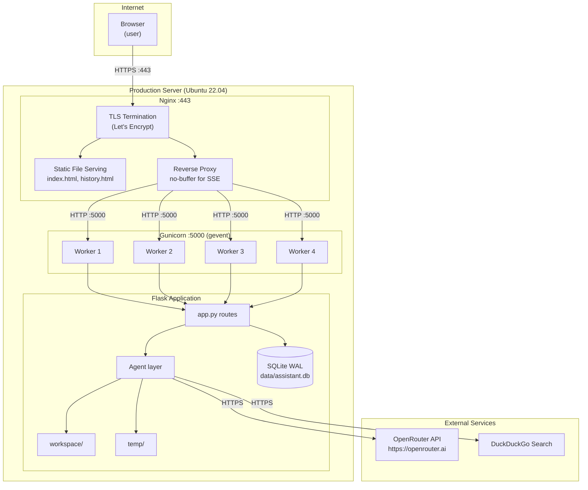

# Deployment Guide — AI Assistant Internal POC

> **Version:** v0.31.0 | **Last updated:** 2026-04-02
>
> This guide covers production deployment on a Linux server (Ubuntu 22.04 LTS). The application
> has no Docker image as of v0.31.0 — deployment is directly to the host using a Python virtual
> environment, Gunicorn, and Nginx as a reverse proxy.

---

## Table of Contents

1. [Architecture Overview](#1-architecture-overview)
2. [System Requirements](#2-system-requirements)
3. [Server Preparation](#3-server-preparation)
4. [Application Setup](#4-application-setup)
5. [Environment Configuration](#5-environment-configuration)
6. [Gunicorn Configuration](#6-gunicorn-configuration)
7. [systemd Service](#7-systemd-service)
8. [Nginx Reverse Proxy](#8-nginx-reverse-proxy)
9. [TLS / HTTPS with Certbot](#9-tls--https-with-certbot)
10. [Post-Deployment Verification](#10-post-deployment-verification)
11. [Monitoring and Logs](#11-monitoring-and-logs)
12. [Updating the Application](#12-updating-the-application)
13. [Rollback Procedure](#13-rollback-procedure)
14. [Production Environment Variables](#14-production-environment-variables)
15. [Infrastructure Diagram](#15-infrastructure-diagram)

---

## 1. Architecture Overview

```
Internet
    |
  [Nginx]  :443 (TLS termination, static files, SSE proxy)
    |
  [Gunicorn + gevent]  :5000 (Flask WSGI, SSE streaming)
    |
  [Flask app]
    |--- [OpenRouter API]   (AI model calls)
    |--- [DuckDuckGo DDGS]  (web search)
    |--- [SQLite WAL]       data/assistant.db
    |--- [workspace/]       saved output files
    `--- [temp/]            PM Agent staging area
```

Gunicorn binds to `127.0.0.1:5000` (localhost only). Nginx listens on port 443, handles TLS, and proxies all requests to Gunicorn. Nginx also serves `index.html` and `history.html` as static files to reduce Gunicorn load, though Flask can serve them directly as a fallback.

---

## 2. System Requirements

| Component | Minimum | Recommended |
|---|---|---|
| OS | Ubuntu 20.04 LTS | Ubuntu 22.04 LTS |
| CPU | 2 cores | 4 cores |
| RAM | 2 GB | 4 GB |
| Disk | 10 GB | 20 GB (workspace files grow over time) |
| Python | 3.10 | 3.12 |
| Network | Outbound HTTPS to `openrouter.ai` and `duckduckgo.com` | Same |

**Note:** WeasyPrint (PDF export) requires several system libraries and can use up to 200 MB of RAM per PDF render. Size the server accordingly if PDF export is heavily used.

---

## 3. Server Preparation

### 3.1 System packages

```bash
sudo apt-get update && sudo apt-get upgrade -y

sudo apt-get install -y \
  python3.12 python3.12-venv python3.12-dev python3-pip \
  build-essential git nginx curl \
  libpango-1.0-0 libpangoft2-1.0-0 libpangocairo-1.0-0 \
  libcairo2 libharfbuzz0b libffi-dev libjpeg-dev \
  libopenjp2-7 libgdk-pixbuf2.0-0 shared-mime-info \
  fonts-thai-tlwg
```

### 3.2 Create a dedicated user

Run the application as a non-root user with no shell login:

```bash
sudo useradd --system --no-create-home --shell /bin/false aiassistant
```

### 3.3 Choose the application directory

```bash
sudo mkdir -p /opt/ai-poc
sudo chown aiassistant:aiassistant /opt/ai-poc
```

---

## 4. Application Setup

### 4.1 Clone the repository

```bash
sudo -u aiassistant git clone <repository-url> /opt/ai-poc
cd /opt/ai-poc
```

### 4.2 Create virtual environment and install dependencies

```bash
sudo -u aiassistant python3.12 -m venv /opt/ai-poc/venv
sudo -u aiassistant /opt/ai-poc/venv/bin/pip install --upgrade pip
sudo -u aiassistant /opt/ai-poc/venv/bin/pip install -r /opt/ai-poc/requirements.txt
```

### 4.3 Create required directories

```bash
sudo -u aiassistant mkdir -p /opt/ai-poc/workspace /opt/ai-poc/temp /opt/ai-poc/data
sudo -u aiassistant touch /opt/ai-poc/temp/.gitkeep
```

### 4.4 Verify WeasyPrint can render Thai text

```bash
sudo -u aiassistant /opt/ai-poc/venv/bin/python3 -c "
from weasyprint import HTML
HTML(string='<html lang=\"th\"><body><p>สวัสดีครับ</p></body></html>').write_pdf('/tmp/test_thai.pdf')
print('WeasyPrint OK')
"
```

If this produces an error about fonts, install additional Thai font packages:

```bash
sudo apt-get install -y fonts-tlwg-garuda fonts-tlwg-norasi
sudo fc-cache -f -v
```

---

## 5. Environment Configuration

### 5.1 Create `.env` from the example

```bash
sudo -u aiassistant cp /opt/ai-poc/.env.example /opt/ai-poc/.env
sudo chmod 640 /opt/ai-poc/.env
sudo chown aiassistant:aiassistant /opt/ai-poc/.env
```

### 5.2 Edit `.env` with production values

```bash
sudo -u aiassistant nano /opt/ai-poc/.env
```

Minimum required changes for production — see [Section 14](#14-production-environment-variables) for the full reference.

```bash
OPENROUTER_API_KEY=sk-or-v1-your-production-key-here
OPENROUTER_MODEL=anthropic/claude-sonnet-4-5
OPENROUTER_TIMEOUT=60

AGENT_MAX_TOKENS=32000
CHAT_MAX_TOKENS=8000
ORCHESTRATOR_MAX_TOKENS=1024

WORKSPACE_PATH=/opt/ai-poc/workspace
ALLOWED_WORKSPACE_ROOTS=/opt/ai-poc

GUNICORN_WORKERS=4
GUNICORN_CONNECTIONS=50
GUNICORN_TIMEOUT=120
GUNICORN_LOG_LEVEL=info

FLASK_HOST=127.0.0.1
FLASK_PORT=5000
FLASK_DEBUG=0

CHAT_RATE_LIMIT=10 per minute
RATELIMIT_STORAGE_URI=memory://

CORS_ORIGINS=https://your-domain.example.com
```

**Security:** Set restrictive permissions so only the `aiassistant` user can read the file:

```bash
sudo chmod 600 /opt/ai-poc/.env
```

---

## 6. Gunicorn Configuration

The file `/opt/ai-poc/gunicorn.conf.py` reads all settings from environment variables:

```python
worker_class = "gevent"
workers = int(os.getenv("GUNICORN_WORKERS", "2"))       # production: 4
worker_connections = int(os.getenv("GUNICORN_CONNECTIONS", "50"))
bind = f"{os.getenv('FLASK_HOST', '0.0.0.0')}:{os.getenv('FLASK_PORT', '5000')}"
timeout = int(os.getenv("GUNICORN_TIMEOUT", "120"))
keepalive = 5
accesslog = "-"
errorlog  = "-"
loglevel  = os.getenv("GUNICORN_LOG_LEVEL", "info")
graceful_timeout = 30
```

**Worker count formula:** `(2 × CPU cores) + 1`, minimum 4.

- With 4 workers: one worker can be fully occupied by a long-running AI call (up to 120 s), one by a `/api/files/stream` SSE subscription, and two remain free for other requests.
- With gevent, each worker handles many concurrent greenlets, so `worker_connections=50` means up to 200 concurrent connections total across 4 workers.

**Manual test of Gunicorn start:**

```bash
cd /opt/ai-poc
sudo -u aiassistant /opt/ai-poc/venv/bin/gunicorn \
  --config gunicorn.conf.py "app:app"
```

Press Ctrl+C to stop. If it starts without errors, proceed to the systemd service.

---

## 7. systemd Service

Create the service file at `/etc/systemd/system/ai-poc.service`:

```bash
sudo nano /etc/systemd/system/ai-poc.service
```

```ini
[Unit]
Description=AI Assistant Internal POC
After=network.target
Wants=network.target

[Service]
Type=exec
User=aiassistant
Group=aiassistant
WorkingDirectory=/opt/ai-poc
EnvironmentFile=/opt/ai-poc/.env

ExecStart=/opt/ai-poc/venv/bin/gunicorn \
    --config /opt/ai-poc/gunicorn.conf.py \
    "app:app"

ExecReload=/bin/kill -HUP $MAINPID

# Graceful shutdown: send TERM, wait graceful_timeout, then KILL
KillMode=mixed
KillSignal=SIGTERM
TimeoutStopSec=35

Restart=on-failure
RestartSec=5
StandardOutput=journal
StandardError=journal
SyslogIdentifier=ai-poc

# Hardening
NoNewPrivileges=true
PrivateTmp=true
ProtectSystem=full
ReadWritePaths=/opt/ai-poc/workspace /opt/ai-poc/temp /opt/ai-poc/data

[Install]
WantedBy=multi-user.target
```

Enable and start:

```bash
sudo systemctl daemon-reload
sudo systemctl enable ai-poc
sudo systemctl start ai-poc
sudo systemctl status ai-poc
```

---

## 8. Nginx Reverse Proxy

### 8.1 Create the site configuration

```bash
sudo nano /etc/nginx/sites-available/ai-poc
```

```nginx
# Upstream to Gunicorn
upstream ai_poc_backend {
    server 127.0.0.1:5000 fail_timeout=0;
}

# Redirect HTTP to HTTPS
server {
    listen 80;
    server_name your-domain.example.com;
    return 301 https://$host$request_uri;
}

server {
    listen 443 ssl http2;
    server_name your-domain.example.com;

    # TLS — filled in by Certbot (see Section 9)
    ssl_certificate     /etc/letsencrypt/live/your-domain.example.com/fullchain.pem;
    ssl_certificate_key /etc/letsencrypt/live/your-domain.example.com/privkey.pem;
    ssl_protocols       TLSv1.2 TLSv1.3;
    ssl_ciphers         HIGH:!aNULL:!MD5;
    ssl_prefer_server_ciphers on;

    # Security headers
    add_header Strict-Transport-Security "max-age=31536000; includeSubDomains" always;
    add_header X-Content-Type-Options    "nosniff" always;
    add_header X-Frame-Options           "SAMEORIGIN" always;
    add_header Referrer-Policy           "strict-origin-when-cross-origin" always;

    # Large file uploads (pending doc in POST body)
    client_max_body_size 10M;

    # Default proxy settings
    proxy_set_header Host              $host;
    proxy_set_header X-Real-IP         $remote_addr;
    proxy_set_header X-Forwarded-For   $proxy_add_x_forwarded_for;
    proxy_set_header X-Forwarded-Proto $scheme;

    # ── SSE endpoints — must NOT buffer ─────────────────────────────────
    # /api/chat and /api/files/stream are Server-Sent Events streams.
    # Buffering breaks streaming: Nginx would hold the entire response
    # before forwarding, making the UI appear to hang until completion.
    location ~ ^/api/(chat|files/stream) {
        proxy_pass          http://ai_poc_backend;
        proxy_buffering     off;
        proxy_cache         off;
        proxy_read_timeout  180s;    # must be > GUNICORN_TIMEOUT (120s)
        proxy_send_timeout  180s;
        # SSE requires chunked transfer; http/1.1 is required for keep-alive
        proxy_http_version  1.1;
        proxy_set_header    Connection "";
        chunked_transfer_encoding on;
    }

    # ── File serving endpoint — allow caching ───────────────────────────
    location /api/serve/ {
        proxy_pass         http://ai_poc_backend;
        proxy_buffering    on;
        proxy_read_timeout 30s;
    }

    # ── All other API routes ─────────────────────────────────────────────
    location /api/ {
        proxy_pass         http://ai_poc_backend;
        proxy_read_timeout 60s;
    }

    # ── Frontend static files ────────────────────────────────────────────
    # Optional: serve index.html and history.html directly from Nginx
    # for a small performance improvement (skips Gunicorn for static files)
    location = / {
        root /opt/ai-poc;
        try_files /index.html =404;
    }
    location = /history {
        root /opt/ai-poc;
        try_files /history.html =404;
    }

    # ── Fallback: all other requests go to Flask ─────────────────────────
    location / {
        proxy_pass         http://ai_poc_backend;
        proxy_read_timeout 60s;
    }
}
```

### 8.2 Enable the site

```bash
sudo ln -s /etc/nginx/sites-available/ai-poc /etc/nginx/sites-enabled/
sudo nginx -t
sudo systemctl reload nginx
```

---

## 9. TLS / HTTPS with Certbot

```bash
sudo apt-get install -y certbot python3-certbot-nginx
sudo certbot --nginx -d your-domain.example.com
```

Certbot automatically edits the Nginx config to add the certificate paths and sets up an auto-renewal cron job. Verify renewal works:

```bash
sudo certbot renew --dry-run
```

---

## 10. Post-Deployment Verification

Run these checks immediately after deployment and after every update.

### 10.1 Service health

```bash
sudo systemctl status ai-poc
curl -s https://your-domain.example.com/api/health | python3 -m json.tool
```

Expected response:
```json
{
  "status": "ok",
  "model": "anthropic/claude-sonnet-4-5",
  "workspace": "/opt/ai-poc/workspace",
  "db": {"available": true, "path": "/opt/ai-poc/data/assistant.db"}
}
```

### 10.2 Chat endpoint smoke test

```bash
curl -s -X POST https://your-domain.example.com/api/chat \
  -H "Content-Type: application/json" \
  -d '{"message": "สวัสดี", "session_id": "smoke-test-00000001"}' \
  --no-buffer | head -20
```

You should see SSE frames starting with `data: {"type":"status",...}`.

### 10.3 SSE streaming test

```bash
curl -s -N https://your-domain.example.com/api/files/stream \
  --max-time 10
```

You should see `data: {"type":"heartbeat"}` frames. If the connection closes immediately, Nginx buffering is incorrectly configured.

### 10.4 Database check

```bash
sudo -u aiassistant sqlite3 /opt/ai-poc/data/assistant.db "SELECT COUNT(*) FROM jobs;"
```

### 10.5 Workspace write test

```bash
sudo -u aiassistant touch /opt/ai-poc/workspace/write_test.tmp
sudo -u aiassistant rm /opt/ai-poc/workspace/write_test.tmp
echo "Workspace writable: OK"
```

---

## 11. Monitoring and Logs

### Application logs (journald)

```bash
# Follow live logs
sudo journalctl -u ai-poc -f

# Last 200 lines
sudo journalctl -u ai-poc -n 200

# Filter to errors only
sudo journalctl -u ai-poc -p err

# Since a specific time
sudo journalctl -u ai-poc --since "2026-04-02 08:00:00"
```

### Nginx access and error logs

```bash
sudo tail -f /var/log/nginx/access.log
sudo tail -f /var/log/nginx/error.log
```

### Key log patterns to watch

| Pattern | Meaning | Action |
|---|---|---|
| `[db] Unavailable` | SQLite database failed to open | Check disk space and `data/` directory permissions |
| `[generate] unhandled error` | Uncaught exception in SSE generator | Check traceback in logs; usually API connectivity or prompt parsing |
| `finish_reason=length` | LLM response truncated | Consider increasing `AGENT_MAX_TOKENS` or switching to a model with higher output limits |
| `Stripped N fake tool call` | Model emitted JSON tool call as plain text | Informational; the system recovered automatically |
| `Empty response at iteration` | LLM returned nothing | Check OpenRouter API status; may be rate limits or model availability |
| `[PMAgent] API error` | PM planning call failed | Check API key validity and OpenRouter quota |
| HTTP 429 in Nginx access log | Client hit rate limit | Review `CHAT_RATE_LIMIT` setting |

### SQLite database inspection

```bash
sudo -u aiassistant sqlite3 /opt/ai-poc/data/assistant.db

-- Most recent jobs
SELECT id, created_at, agent, status, substr(user_input,1,60) FROM jobs ORDER BY created_at DESC LIMIT 10;

-- Error jobs in last hour
SELECT id, created_at, user_input FROM jobs
WHERE status = 'error' AND created_at > datetime('now', '-1 hour');

-- Files saved today
SELECT f.filename, f.agent, f.size_bytes, j.session_id
FROM saved_files f JOIN jobs j ON f.job_id = j.id
WHERE f.created_at > datetime('now', 'start of day');

.quit
```

---

## 12. Updating the Application

### Zero-downtime update procedure

Gunicorn supports graceful restarts via `SIGHUP`. In-flight requests (including active SSE streams) are completed by the old workers before they exit.

```bash
# 1. Pull the new code
cd /opt/ai-poc
sudo -u aiassistant git fetch origin
sudo -u aiassistant git checkout main
sudo -u aiassistant git pull

# 2. Update Python dependencies (if requirements.txt changed)
sudo -u aiassistant /opt/ai-poc/venv/bin/pip install -r requirements.txt

# 3. Graceful reload — existing connections stay alive
sudo systemctl reload ai-poc
# Internally: systemctl sends SIGHUP to the Gunicorn master process,
# which spawns new workers and waits for old workers to finish
# their in-flight requests before killing them.

# 4. Verify the new version is running
curl -s https://your-domain.example.com/api/health
```

**When is a full restart required instead of a graceful reload?**
- Changes to `gunicorn.conf.py` (e.g., worker count)
- Changes to `.env` (environment variables are loaded at worker startup)
- Any change requiring a fresh process start

```bash
sudo systemctl restart ai-poc
```

---

## 13. Rollback Procedure

If a deployment causes errors:

```bash
# 1. Identify the last stable commit
cd /opt/ai-poc
sudo -u aiassistant git log --oneline -10

# 2. Check out the previous version
sudo -u aiassistant git checkout <previous-commit-hash>

# 3. Re-install dependencies for that version (if requirements.txt changed)
sudo -u aiassistant /opt/ai-poc/venv/bin/pip install -r requirements.txt

# 4. Restart the service
sudo systemctl restart ai-poc

# 5. Verify health
curl -s https://your-domain.example.com/api/health
```

**Database rollback:** SQLite with WAL mode does not require a rollback — schema changes use `CREATE TABLE IF NOT EXISTS` and `CREATE INDEX IF NOT EXISTS`, which are safe to re-run. If a migration causes corruption, restore from backup:

```bash
sudo systemctl stop ai-poc
sudo -u aiassistant cp /opt/ai-poc/data/assistant.db.backup /opt/ai-poc/data/assistant.db
sudo systemctl start ai-poc
```

---

## 14. Production Environment Variables

Complete reference for production `.env`. See `README.md` for default values.

```bash
# ─── Required ─────────────────────────────────────────────────────────────────
OPENROUTER_API_KEY=sk-or-v1-...

# ─── AI Model ─────────────────────────────────────────────────────────────────
OPENROUTER_MODEL=anthropic/claude-sonnet-4-5
# Increase if using slow models or generating very long documents
OPENROUTER_TIMEOUT=60

# Token limits — set to match your chosen model's output token maximum
AGENT_MAX_TOKENS=32000
CHAT_MAX_TOKENS=8000
ORCHESTRATOR_MAX_TOKENS=1024

# ─── Workspace ────────────────────────────────────────────────────────────────
WORKSPACE_PATH=/opt/ai-poc/workspace
# Restrict all workspace operations to within /opt/ai-poc
ALLOWED_WORKSPACE_ROOTS=/opt/ai-poc
MAX_PENDING_DOC_BYTES=204800
WEB_SEARCH_TIMEOUT=15

# ─── Gunicorn ─────────────────────────────────────────────────────────────────
# Formula: (2 × CPU cores) + 1, minimum 4
GUNICORN_WORKERS=4
GUNICORN_CONNECTIONS=50
# Must be higher than OPENROUTER_TIMEOUT
GUNICORN_TIMEOUT=120
GUNICORN_LOG_LEVEL=info

# ─── Flask ────────────────────────────────────────────────────────────────────
# Bind to localhost only — Nginx handles external connections
FLASK_HOST=127.0.0.1
FLASK_PORT=5000
# CRITICAL: must be 0 in production
FLASK_DEBUG=0

# ─── Rate Limiting ────────────────────────────────────────────────────────────
CHAT_RATE_LIMIT=10 per minute
# For multi-process production, use Redis for cross-process rate limit state
# RATELIMIT_STORAGE_URI=redis://localhost:6379/0
RATELIMIT_STORAGE_URI=memory://

# ─── CORS ─────────────────────────────────────────────────────────────────────
# Replace with your actual production domain(s)
CORS_ORIGINS=https://your-domain.example.com
```

---

## 15. Infrastructure Diagram


